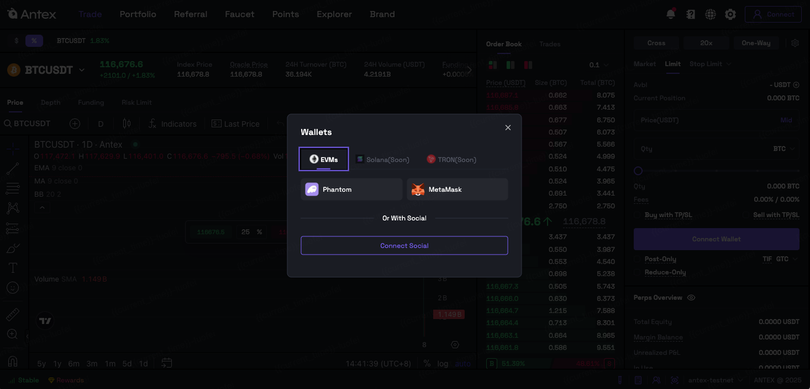

---
layout:
  width: default
  title:
    visible: true
  description:
    visible: false
  tableOfContents:
    visible: true
  outline:
    visible: true
  pagination:
    visible: true
  metadata:
    visible: true
---

# Login With DeFi Wallet

DeFi wallet (recommended if you already use MetaMask/Phantom/etc.) — you keep your own keys and can use any supported wallet extension or mobile wallet app.

## Open AnteX Dapp

* Go to [https://testnet.antex.ai/en/future/BTCUSDT](https://testnet.antex.ai/en/future/BTCUSDT)

## **Install wallet extension (if you don’t have one)**

* If you use desktop, install MetaMask, or Phantom browser extension.
* If on mobile: install the wallet app (MetaMask app, Phantom app, etc.) and use WalletConnect to link.（Coming soon）

## **Connect to** AnteX

* Click **Connect** on AnteX → choose your wallet (MetaMask / Phantom / ...).

<figure><figcaption></figcaption></figure>

<figure><figcaption></figcaption></figure>

<figure><figcaption></figcaption></figure>

* A wallet pop-up appears asking you to allow the connection — **Approve/Connect**.

<figure><figcaption></figcaption></figure>

<figure><figcaption></figcaption></figure>

## **Enable trading (if needed)**

* A one-time signature (**gasless**) to enable trading. If prompted, sign the enable message — it authorizes the app to read or interact with your address.

<figure><figcaption></figcaption></figure>

<figure><figcaption></figcaption></figure>
